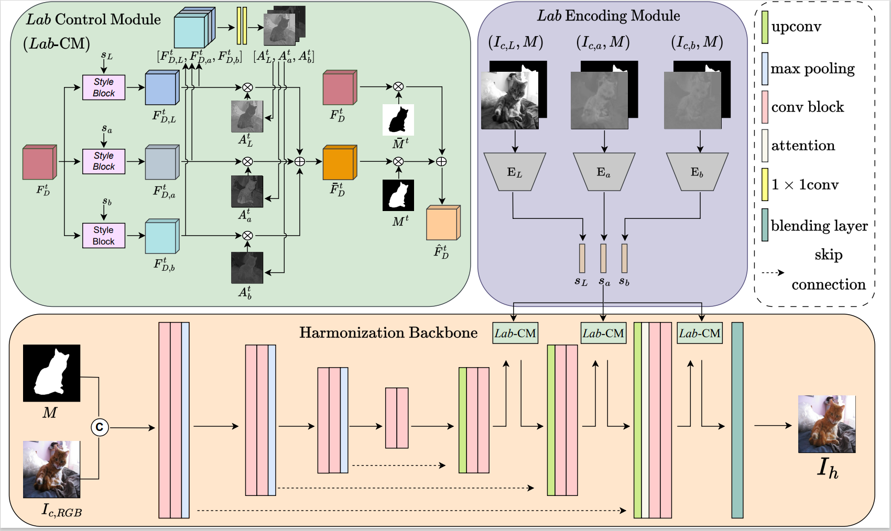

[ACM MM-23] Deep image harmonization in Dual Color Space [ACM MM-23]

[](https://paperswithcode.com/sota/image-harmonization-on-iharmony4?p=deep-image-harmonization-in-dual-color-spaces)


This is the official repository for the following paper:

> **Deep Image Harmonization in Dual Color Spaces**  [[arXiv]](https://arxiv.org/abs/2308.02813)<br>
>
> Linfeng Tan, Jiangtong Li, Li Niu, Liqing Zhang<br>
> Accepted by **ACMMM2023**.

>Image harmonization is an essential step in image composition that adjusts the appearance of composite foreground to address the inconsistency between foreground and background. Existing methods primarily operate in correlated $RGB$ color space, leading to entangled features and limited representation ability. In contrast, decorrelated color space ($Lab$) has decorrelated channels that provide disentangled color and illumination statistics. In this paper, we explore image harmonization in dual color spaces, which supplements entangled $RGB$ features with disentangled $L$, $a$, $b$ features to alleviate the workload in harmonization process. The network comprises a $RGB$ harmonization backbone, an $Lab$ encoding module, and an $Lab$ control module. The backbone is a U-Net network translating composite image to harmonized image. Three encoders in $Lab$ encoding module extract three control codes independently from $L$, $a$, $b$ channels, which are used to manipulate the decoder features in harmonization backbone via $Lab$ control module. 



## Getting Started

### Prerequisites
Please refer to [iSSAM](https://github.com/saic-vul/image_harmonization) for guidance on setting up the environment.

### Installation
+ Clone this repo: 
```
git clone https://github.com/bcmi/DucoNet-Image-Harmonization.git
cd ./DucoNet-Image-Harmonization
```
+ Download the [iHarmony4](https://github.com/bcmi/Image-Harmonization-Dataset-iHarmony4) dataset, and configure the paths to the datasets in [config.yml](./config.yml).

- Install PyTorch and dependencies from http://pytorch.org.

- Install python requirements:

```bash
pip install -r requirements.txt
```

### Training
If you want to train DucoNet on dataset [iHarmony4](https://github.com/bcmi/Image-Harmonization-Dataset-iHarmony4), you can run this command:

```
## for low-resolution 

python train.py models/DucoNet_256.py --workers=8 --gpus=0,1 --exp-name=DucoNet_256 --batch-size=64

## for high-resolution 

python train.py models/DucoNet_1024.py --workers=8 --gpus=2,3 --exp-name=DucoNet_1024 --batch-size=4
```

We have also provided some commands in the "train.sh" for your convenience.

### Testing
You can run the following command to test the pretrained model, and you can download the pre-trained model we released from [Google Drive](https://drive.google.com/drive/folders/1TDKS1H99vhbEOwo8JK5rcw1Zl3WyTSTS?usp=sharing) or [Baidu Cloud](https://pan.baidu.com/s/1lnDOnmN1tLeoIcvjWvWFkQ?pwd=bcmi):
```
python scripts/evaluate_model.py DucoNet ./checkpoints/last_model/DucoNet256.pth \
--resize-strategy Fixed256 \
--gpu 0 

#python scripts/evaluate_model.py DucoNet ./checkpoints/last_model/DucoNet1024.pth \
#--resize-strategy Fixed1024 \
#--gpu 1 \
#--datasets HAdobe5k1 
```

We have also provided some commands in the "test.sh" for your convenience.

## Results and Pretrained model

We test our DucoNet on iHarmony4 dataset with image size 256&times;256 and on HAdobe5k dataset with image size 1024&times;1024. We report our results on evaluation metrics, including MSE, fMSE, and PSNR. 
We also released the pretrained model corresponding to our results, you can download it from the corresponding link.

| Image Size         | fMSE   | MSE   | PSNR  | Google Drive     | Baidu Cloud      |
| ------------------ | ------ | ----- | ----- | ---------------- | ---------------- |
| 256 $\times$ 256   | 212.53 | 18.47 | 39.17 | [Google Drive](https://drive.google.com/drive/folders/1TDKS1H99vhbEOwo8JK5rcw1Zl3WyTSTS?usp=sharing) | [Baidu Cloud](https://pan.baidu.com/s/1lnDOnmN1tLeoIcvjWvWFkQ?pwd=bcmi) |
| 1024 $\times$ 1024 | 80.69  | 10.94 | 41.37 | [Google Drive](https://drive.google.com/drive/folders/1TDKS1H99vhbEOwo8JK5rcw1Zl3WyTSTS?usp=sharing) | [Baidu Cloud](https://pan.baidu.com/s/1lnDOnmN1tLeoIcvjWvWFkQ?pwd=bcmi) |

## Other Resources

+ [Awesome-Image-Harmonization](https://github.com/bcmi/Awesome-Image-Harmonization)
+ [Awesome-Image-Composition](https://github.com/bcmi/Awesome-Image-Composition)

## Acknowledgement<a name="codesource"></a> 

Our code is heavily borrowed from [iSSAM](https://github.com/saic-vul/image_harmonization) and PyTorch implementation of [styleGANv2](https://github.com/labmlai/annotated_deep_learning_paper_implementations) .

## Bibtex:
If you are interested in our work, please consider citing the following:

```
@article{tan2023deep,
  title={Deep Image Harmonization in Dual Color Spaces},
  author={Tan, Linfeng and Li, Jiangtong and Niu, Li and Zhang, Liqing},
  journal={arXiv preprint arXiv:2308.02813},
  year={2023}
}
